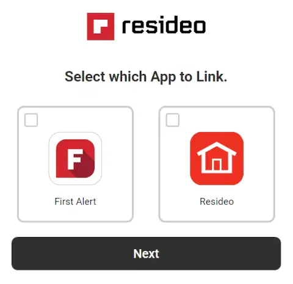
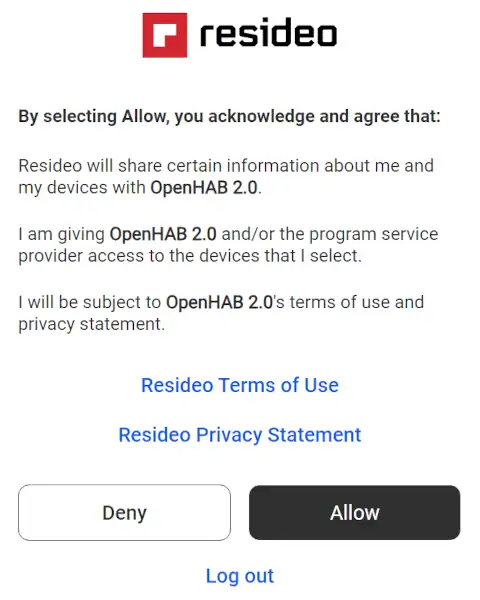
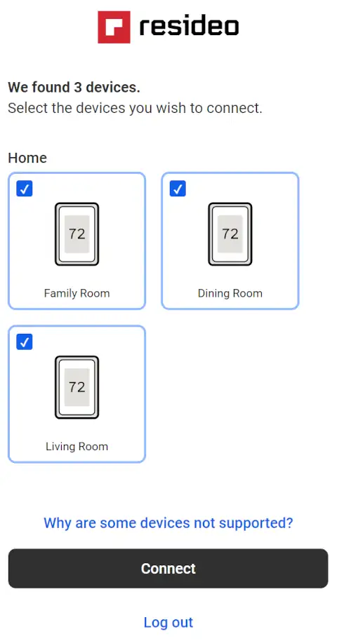

# Honeywell Binding

The binding is used to access the Honeywell thermostats and sensors.

It has been tested in a house with multiple Honeywell Home T9 thermostats each connecting multiple indoor sensors.

The Honeywell system groups thermostats into locations (Home, Cottage, etc) where each location can have multiple thermostats.
Each thermostat in turn is linked with upto ten indoor sensors.

## Prerequisites

A Lyric Round or T-Series thermostat registered on the "Resideo Smart Home" or "First Alert App" systems.

## Supported Things

The binding has three things.

- `oauth20`: A bridge binding that connects to the Resideo API system.
- `thermostat`: A thermostat bridge binding that retrieves and transmits the thermostat/sensor data.
- `sensor`: A sensor binding that displays the sensor information.

## Discovery

Once an authorized bridge has been created and connected, the discovery can search for thermostats and sensors.
It will search all locations and find all thermostats that have been selected during the autorization of the bridge.
The `thermostat` thing acts as a bridge from the `oauth20` bridge to the `sensor` thing.
Make sure the `thermostat` thing is created first before creating any sensor things (including the sensor thing that is the thermostat).
A `thermostat` thing allows setting and viewing information and a `sensor` thing is readonly.
For a normal home with one thermostat and one sensor in the bedroom you will create the `oath20` bridge and the binding will create one `thermostat` and two `sensor` things.

## Binding Configuration

Each thermostat will require one request for the thermostat information and one request for the sensor information (regardless of home many sensors there are).
The Resideo Developer system has a limited amount of requests allowed for each API key.
For this reason it is necessary to setup your own API key when the binding is first used.

After the binding is installed it will create a servlet at `http://<your openHAB address>:8080/connecthoneywell` and `https://<your openHAB address>:8443/connecthoneywell`.
Visit that address for instructions on creating and linking the Honeywell binding to the Honeywell API.
The linking process will take you through the authorization process.
Which includes:

### App Selection



### Login


### Deny/Allow



### Thermostat Selection



## Thing Configuration

### `oauth20` Bridge Thing Configuration

| Name              | Type    | Default | Required | Advanced | Description                                   |
|-------------------|---------|---------|----------|----------|-----------------------------------------------|
| consumerKey       | text    | N/A     | yes      | no       | Resideo application consumer key              |
| consumerSecret    | text    | N/A     | yes      | no       | Resideo application consumer secret           |
| optimized         | boolean | false   | yes      | yes      | Has the provided refresh time been optimized? |
| refresh           | integer | 300     | yes      | yes      | Poll time for getting readings from Resideo   |
| timeout           | integer | 3000    | yes      | yes      | The timeout for each request (ms)             |

- If optimized is NOT set the binding will try to find the smallest refresh time which does not lead to the rate limit being hit.

### `thermostat` Thing Configuration

| Name              | Type    | Default | Required | Advanced | Description                           |
|-------------------|---------|---------|----------|----------|---------------------------------------|
| locationId        | integer | N/A     | yes      | no       | Unique location number for the device |
| deviceId          | text    | N/A     | yes      | no       | Thermostat device id string           |
| groupId           | integer | 0       | yes      | yes      | Only ever seen 0 here just in case    |
| ianaTimeZone      | text    |         | no       | yes      | Thermostat location timezone          |

- locationId is just some number Honeywell generates for you.
- deviceId is eithe LCC- or TCC- followed by the mac address of the thermostat or a uuid.
- groupId is a grouping of rooms, there isn't any documentation on it so leave at 0 unless you know why you need to change it.
- ianaTimeZone is the time zone for the location that the thermostat is in, the discovery process will pull the value from the thermostat, if it is blank then the openHAB system default is used.

### `sensor` Thing Configuration

| Name              | Type    | Default | Required | Advanced | Description                           |
|-------------------|---------|---------|----------|----------|---------------------------------------|
| sensorId          | integer | N/A     | yes      | no       | Index of the sensor                   |

- sensorId is the number of the sensor 0 is always the thermostat.

## Channels

| Channel              | Type                 | Read/Write | Thing             | Description                   |
|----------------------|----------------------|------------|-------------------|-------------------------------|
| connected            | switch               | R          | oauth20           | Did the last connect succeed  |
| optimized            | switch               | R          | oauth20           | Refresh timing optimized      |
| refresh              | integer              | R          | oauth20           | Current refresh time used     |
| outdoor-temperature  | number:temperature   | R          | thermostat        | Current outdoor temperature   |
| atmospheric-humidity | number:dimensionless | R          | thermostat        | Current atmosphieric humidity |
| mode                 | string               | RW         | thermostat        | Thermostat operating mode     |
| schedulestatus       | string               | RW         | thermostat        | Current status of schedule    |
| setpointstatus       | string               | RW         | thermostat        | Hold mode                     |
| nextperiodtime       | datetime             | RW         | thermostat        | Hold mode timing              |
| heatsetpoint         | number:temperature   | RW         | thermostat        | Heating setpoint temperature  |
| coolsetpoint         | number:temperature   | RW         | thermostat        | Cooling setpoint temperature  |
| fanmode              | string               | RW         | thermostat        | Fan operating mode            |
| indoor-temperature   | number:temperature   | R          | sensor/thermostat | Current indoor temperature    |
| humidity             | number:dimensionless | R          | sensor/thermostat | Current indoor humidity       |
| signal-strength      | number               | R          | sensor            | Signal strength to the base   |
| motion               | switch               | R          | sensor            | Is there motion               |
| occupancy            | switch               | R          | sensor            | Is it marked occupied         |
| low-battery          | switch               | R          | sensor            | Battery status                |
| status               | switch               | R          | sensor            | Status of accessory           |

- nextperiodtime will be sent based on the system time zone.

## Full Example

### Thing Configuration

`.things` file:

It is suggested that the discovery service is used for creating the things in openHAB.
Respecting the thermostat's time zone when changing `nextperiodtime` is only supported if the things are created using the discovery service.
This is only an issue if the openHAB system and the thermostats (one or more) have different time zones.

```java
Bridge honeywell:oauth20:openhab "Honeywell API Bridge" [ consumerKey="supersecretkeynoteventellingmom", consumerSecret="extrasecretsecre", optimized="false", refresh="90" ] {
        Bridge thermostat LCC-112233445566 "Family Room Thermostat" [ locationId="9999999", deviceId="LCC-112233445566" ] {
                Thing sensor 0 "Family Room Thermostat Sensor" [sensorId="0" ]
                Thing sensor 1 "Master Bedroom Sensor" [sensorId="1" ]
                Thing sensor 2 "Family Room Sensor" [sensorId="2" ]
                Thing sensor 3 "Bathroom Sensor" [sensorId="3" ]
        }
        Bridge thermostat LCC-112233445577 "Dining Room Thermostat" [ locationId="9999999", deviceId="LCC-112233445577" ] {
                Thing sensor 0 "Dining Room Thermostat Sensor" [ sensorId="0" ]
                Thing sensor 1 "Kitchen Sensor" [ sensorId="1" ]
                Thing sensor 2 "Dining Room Sensor" [ sensorId="2" ]
        }
        Bridge thermostat LCC-112233445588 "Living Room Thermostat" [ locationId="9999999", deviceId="LCC-112233445588" ] {
                Thing sensor 0 "Living Room Thermostat Sensor" [ sensorId="0" ]
                Thing sensor 1 "Third Bedroom Sensor" [ sensorId="1" ]
                Thing sensor 2 "Main Bathroom Sensor" [ sensorId="2" ]
                Thing sensor 3 "Second Bedroom Sensor" [ sensorId="3" ]
                Thing sensor 4 "Main Bedroom Sensor" [ sensorId="4" ]
                Thing sensor 5 "Living Room Sensor" [ sensorId="5" ]
        }
}

```

### Item Configuration

`.items` file:

```java
// Equipment representing thing:
// honeywell:oauth20:openhab
// (Honeywell API Bridge)

Group Honeywell_API_Bridge "Honeywell API Bridge" ["Equipment"]

// Points:

Switch      Honeywell_API_Bridge_Connected    "Connected"    <Status> (Honeywell_API_Bridge) ["Status"]  { channel="honeywell:oauth20:openhab:connected" }
Switch      Honeywell_API_Bridge_Optimized    "Optimized"    <Status> (Honeywell_API_Bridge) ["Status"]  { channel="honeywell:oauth20:openhab:optimized" }
Number:Time Honeywell_API_Bridge_Refresh_Time "Refresh Time" <Status> (Honeywell_API_Bridge) ["Status"]  { channel="honeywell:oauth20:openhab:refresh" }

// Equipment representing thing:
// honeywell:thermostat:LCC-112233445566
// (Home Thermostat)

Group Home_Thermostat "Home Thermostat" ["Equipment"]

// Points:

Number:Temperature   Home_Thermostat_measurementsoutdoortemperature  "Outdoor Temperature"  <Temperature>      (Home_Thermostat) ["Temperature", "Measurement"]  { channel="honeywell:thermostat:openhab:LCC-112233445566:measurements#outdoor-temperature" }
Number:Dimensionless Home_Thermostat_measurementsatmospherichumidity "Atmospheric Humidity" <Humidity>         (Home_Thermostat) ["Humidity", "Measurement"]     { channel="honeywell:thermostat:openhab:LCC-112233445566:measurements#atmospheric-humidity" }
Number:Temperature   Home_Thermostat_measurementsindoortemperature   "Indoor Temperature"   <Temperature>      (Home_Thermostat) ["Temperature", "Measurement"]  { channel="honeywell:thermostat:openhab:LCC-112233445566:measurements#indoor-temperature" }
Number:Dimensionless Home_Thermostat_measurementshumidity            "Indoor Humidity"      <Humidity>         (Home_Thermostat) ["Humidity", "Measurement"]     { channel="honeywell:thermostat:openhab:LCC-112233445566:measurements#humidity" }
String               Home_Thermostat_settingsmode                    "Thermostat Mode"      <Heating>          (Home_Thermostat) ["None", "Control"]             { channel="honeywell:thermostat:openhab:LCC-112233445566:settings#mode" }
String               Home_Thermostat_settingsschedulestatus          "Schedule Status"      <Heating>          (Home_Thermostat) ["None", "Control"]             { channel="honeywell:thermostat:openhab:LCC-112233445566:settings#schedulestatus" }
String               Home_Thermostat_settingssetpointstatus          "Setpoint Status"      <Heating>          (Home_Thermostat) ["Duration", "Control"]         { channel="honeywell:thermostat:openhab:LCC-112233445566:settings#setpointstatus" }
DateTime             Home_Thermostat_settingsnextperiodtime          "Next Period Time"     <Time>             (Home_Thermostat) ["Timestamp", "Control"]        { channel="honeywell:thermostat:openhab:LCC-112233445566:settings#nextperiodtime" }
Number:Temperature   Home_Thermostat_settingsheatsetpoint            "Heat Setpoint"        <Temperature_hot>  (Home_Thermostat) ["Control", "Temperature"]      { channel="honeywell:thermostat:openhab:LCC-112233445566:settings#heatsetpoint" }
Number:Temperature   Home_Thermostat_settingscoolsetpoint            "Cool Setpoint"        <Temperature_cold> (Home_Thermostat) ["Control", "Temperature"]      { channel="honeywell:thermostat:openhab:LCC-112233445566:settings#coolsetpoint" }

// Equipment representing thing:
// honeywell:sensor:0
// (Home Thermostat Sensor)

Group Home_Thermostat_Sensor "Home Thermostat Sensor" ["Equipment"]

// Points:

Number:Temperature   Home_Thermostat_Sensor_readingsindoortemperature "Indoor Temperature" <Temperature>      (Home_Thermostat_Sensor) ["Temperature", "Measurement"]  { channel="honeywell:sensor:openhab:LCC-112233445566:0:readings#indoor-temperature" }
Number:Dimensionless Home_Thermostat_Sensor_readingshumidity          "Indoor Humidity"    <Humidity>         (Home_Thermostat_Sensor) ["Humidity", "Measurement"]     { channel="honeywell:sensor:openhab:LCC-112233445566:0:readings#humidity" }
Number               Home_Thermostat_Sensor_connectionsignalstrength  "Signal Strength"    <QualityOfService> (Home_Thermostat_Sensor) ["Level", "Measurement"]        { channel="honeywell:sensor:openhab:LCC-112233445566:0:connection#signal-strength" }
Switch               Home_Thermostat_Sensor_connectionstatus          "Connected"          <Network>          (Home_Thermostat_Sensor) ["Point"]                       { channel="honeywell:sensor:openhab:LCC-112233445566:0:connection#status" }

// Equipment representing thing:
// honeywell:sensor:1
// (Bedroom Room Sensor)

Group Bedroom_Room_Sensor "Bedroom Room Sensor" ["Equipment"]

// Points:

Number:Temperature   Bedroom_Room_Sensor_readingsindoortemperature "Indoor Temperature" <Temperature>      (Bedroom_Room_Sensor) ["Temperature", "Measurement"]  { channel="honeywell:sensor:openhab:LCC-112233445566:1:readings#indoor-temperature" }
Number:Dimensionless Bedroom_Room_Sensor_readingshumidity          "Indoor Humidity"    <Humidity>         (Bedroom_Room_Sensor) ["Humidity", "Measurement"]     { channel="honeywell:sensor:openhab:LCC-112233445566:1:readings#humidity" }
Switch               Bedroom_Room_Sensor_sensormotion              "Motion"             <Motion>           (Bedroom_Room_Sensor) ["Presence", "Status"]          { channel="honeywell:sensor:openhab:LCC-112233445566:1:sensor#motion" }
Switch               Bedroom_Room_Sensor_sensoroccupancy           "Occupancy"          <Presence>         (Bedroom_Room_Sensor) ["Presence", "Measurement"]     { channel="honeywell:sensor:openhab:LCC-112233445566:1:sensor#occupancy" }
Switch               Bedroom_Room_Sensor_sensorlowbattery          "Low Battery"        <LowBattery>       (Bedroom_Room_Sensor) ["LowBattery", "Energy"]        { channel="honeywell:sensor:openhab:LCC-112233445566:1:sensor#low-battery" }
Number               Bedroom_Room_Sensor_connectionsignalstrength  "Signal Strength"    <QualityOfService> (Bedroom_Room_Sensor) ["Level", "Measurement"]        { channel="honeywell:sensor:openhab:LCC-112233445566:1:connection#signal-strength" }
Switch               Bedroom_Room_Sensor_connectionstatus          "Connected"          <Network>          (Bedroom_Room_Sensor) ["Point"]                       { channel="honeywell:sensor:openhab:LCC-112233445566:1:connection#status" }
```
